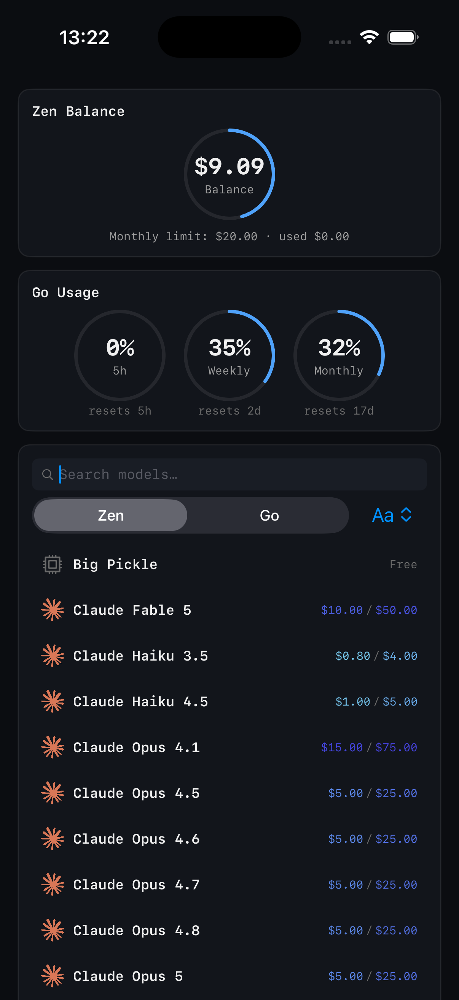

# dandelion-ios

A native iOS app for **OpenCode Zen** (pay-as-you-go) and **OpenCode Go** (subscription) - live balance/usage plus the full model catalog, no browser or CLI required. iOS counterpart to the [macOS menu-bar app](https://github.com/Yyukan/dandelion).


## What it shows

- Zen balance, auto-reload threshold, monthly limit
- Go 5h/weekly/monthly usage windows and reset countdowns
- Zen/Go model catalog: pricing and context/output limits

<p align="center">
  
</p>

## Widgets

Two widget surfaces, all driven by a single `WidgetUsageSnapshot` the host app writes to the App Group after every refresh - the widget extension never fetches:

- **Lock Screen** (`.accessoryCircular`): one ring per metric - Balance ($), 5h, Weekly, Monthly. Add as many as your Lock Screen has room for.
- **Home Screen** (`.systemSmall`): a single 2×2 dashboard with all four rings. Tap to open Dandelion.

## Requirements

- iOS 17+, Xcode 16+
- [XcodeGen](https://github.com/yonaskolb/XcodeGen): `brew install xcodegen`
- An Apple ID in Xcode to sign the app for your device (free personal team is enough)

## Running locally

```bash
xcodegen generate
open DandelionIOS.xcodeproj
```

Select the **DandelionIOS** scheme, pick your iPhone (or a Simulator), press **Run** (⌘R). First run on a device: pick your team under Signing & Capabilities. The Lock Screen + Home Screen widgets become available in the widget gallery once the host app has been installed.

## License

See [LICENSE](LICENSE).
